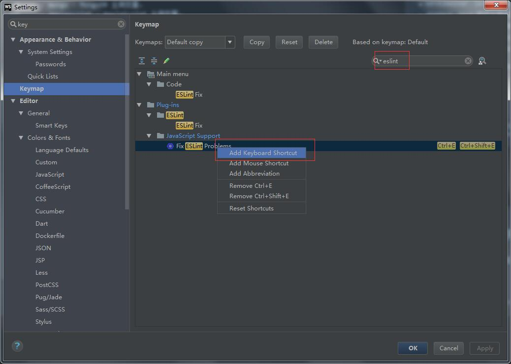
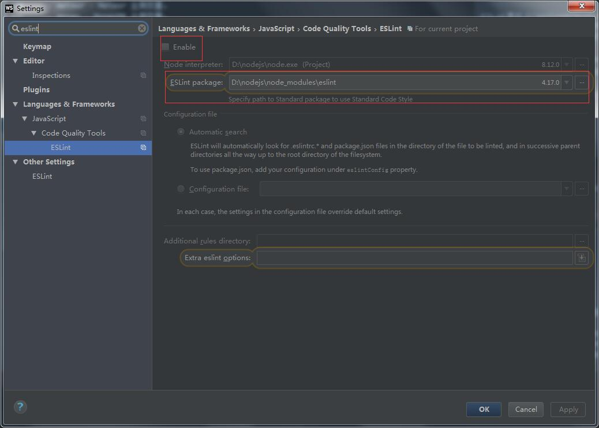

## 概述

ESLint 是在 ECMAScript/JavaScript 代码中识别和报告模式匹配的工具，它的目标是保证代码的一致性和避免错误。在许多方面，它和 JSLint、JSHint 相似，除了少数的例外：

- ESLint 使用 Espree 解析 JavaScript。
- ESLint 使用 AST 去分析代码中的模式
- ESLint 是完全插件化的。每一个规则都是一个插件并且你可以在运行时添加更多的规则。

## 使用

````
// 安装
yarn add eslint --dev

// 生成配置文件，或者：npx eslint --init
./node_modules/.bin/eslint --init 

// 运行
./node_modules/.bin/eslint yourfile.js
````

第二个值为规则的配置对象。

## extends

extend 提供的是 eslint 现有规则的一系列预设。

它可以继承多个。如安装了 eslint-config-airbnb，就可以在 extends 这里引用 airbnb/base, 这样就相当于预设了 airbnb/base 的规则，常用的预设："eslint:recommended" "airbnb/base" "stanard"(需先安装 eslint-config-standard)。当然，除了 eslint-config-xxx 提供了一系列预设，插件（eslint-plugin-xxx）也能提供预设用于继承，例如，当你安装了 eslint-plugin-react 时，就可以在 extends 这里指定 "plugin:react/recommended"，当然，也可以指定一个具体的 eslint 配置文件 path/to/file 继承。

````
{
    extends: [
        "airbnb/base",
        "plugin:react/recommended"
    ]
}
````

假设以`aribnb`风格（一般以`eslint-config-`开头）为例：

````
yarn add eslint-config-aribnb --dev
````

然后在`.eslintrc.js`文件添加：

````
{
    extends: ['aribnb']
}
````

> aribnb的javascript风格：https://github.com/airbnb/javascript

## plugins

这里指定插件，插件名一般为 eslint-plugin-xxx，这里可以缩写为 xxx，插件提供了除 eslint 规定之外额外的规则。

plugin 与 extend 的区别：extend 提供的是 eslint 现有规则的一系列预设而 plugin 则提供了除预设之外的自定义规则，当你在 eslint 的规则里找不到合适的的时候就可以借用插件来实现了

````
"plugins": [
    // 这里安装了 eslint-plugin-import
    "import"
]
````

## rules

在`.eslintrc.js`中会存在`rules`规则配置。第一个值是错误级别，可以使用以下值之一：

- `off`或`0`：关闭规则
- `warn`或者`1`：将规则视为一个警告（不会影响退出码）
- `error`或者`2`：将规则视为一个错误 (退出码为1)

>  两种格式："rule-name": 0/1/2    "rule-name": [0/1/2, configDetail]，当然前面的0/1/2也可以使用英文表示。

## parser

默认使用 eslint 自己的 Espree（可支持 ES5，ES6，ES7）来进行解析，但是在一些实验性语法等eslint本身不支持时会报错，所以一般我们会使用`eslint-babel`转换器：

````
yarn add babel-eslint --dev
````

````
{
    parser: 'babel-eslint`
}
````

可以通过`parserOptions`来配置转换器，这里不展开说明，请查看相对应的转换器文档。

## env

指定环境，每个环境都有自己预定义的全局变量，可以同时指定多个环境，不矛盾，主流的库或构建系统都能支持，列表见官方文档：http://eslint.cn/docs/user-guide/configuring#specifying-environments

- browser - 浏览器环境中的全局变量。
- node - Node.js 全局变量和 Node.js 作用域。
- commonjs - CommonJS 全局变量和 CommonJS 作用域 (用于 Browserify/WebPack 打包的只在浏览器中运行的代码)。
- shared-node-browser - Node.js 和 Browser 通用全局变量。
- es6 - 启用除了 modules 以外的所有 ECMAScript 6 特性（该选项会自动设置 ecmaVersion 解析器选项为 6）。
- worker - Web Workers 全局变量。
- amd - 将 require() 和 define() 定义为像 amd 一样的全局变量。
- mocha - 添加所有的 Mocha 测试全局变量。
- jasmine - 添加所有的 Jasmine 版本 1.3 和 2.0 的测试全局变量。
- jest - Jest 全局变量。
- phantomjs - PhantomJS 全局变量。
- protractor - Protractor 全局变量。
- qunit - QUnit 全局变量。
- jquery - jQuery 全局变量。
- prototypejs - Prototype.js 全局变量。
- shelljs - ShellJS 全局变量。
- meteor - Meteor 全局变量。
- mongo - MongoDB 全局变量。
- applescript - AppleScript 全局变量。
- nashorn - Java 8 Nashorn 全局变量。
- serviceworker - Service Worker 全局变量。
- atomtest - Atom 测试全局变量。
- embertest - Ember 测试全局变量。
- webextensions - WebExtensions 全局变量。
- greasemonkey - GreaseMonkey 全局变量。

比如指定`browser: true`，则代码中的`window`、`document`等全局对象就不会报未定义。

## global

指定环境为我们提供了其预置的全局变量，对于那些我们自定义的全局变量，可以在这里指定，设为 true 表示不应该被重写，设为 false 表示可以被重写。

````
{
    "global": {
        var1: true,
        var2: false
    }
}
````

## settings

ESLint 支持在配置文件添加共享设置。你可以添加 settings 对象到配置文件，它将提供给每一个将被执行的规则。如果你想添加的自定义规则而且使它们可以访问到相同的信息，这将会很有用，并且很容易配置。

参考：https://github.com/benmosher/eslint-plugin-import#settings

## overrides

有时，你可能需要更精细的配置，比如，如果同一个目录下的文件需要有不同的配置。因此，你可以在配置中使用 overrides 键，它只适用于匹配特定的 glob 模式的文件，使用你在命令行上传递的格式 (e.g., app/**/*.test.js)。

## 在webstrom中使用

首先设置eslint修复的快捷键：



> 我设置的是`ctrl + E`，本来想设置`ctrl + S`保存代码时自动修改，但是好像会冲突。

在webstrom中，需要开启eslint配置项：



> 这里的`Eslint Packge`一定要选项目的中的eslint哦！

之后试一下`ctrl + E`看能不能自动修改代码，如果不行，***请点击`File -> Invalidate Caches / Restart`重启webstrom即可***。

## 禁用规则

可以在你的文件中使用以下格式的块注释来临时禁止规则出现警告：

````
/* eslint-disable */

alert('foo');

/* eslint-enable */
````

你也可以对指定的规则启用或禁用警告:

````
/* eslint-disable no-alert, no-console */

alert('foo');
console.log('bar');

/* eslint-enable no-alert, no-console */
````

如果在整个文件范围内禁止规则出现警告，将 `/* eslint-disable */` 块注释放在文件顶部：

````
/* eslint-disable */

alert('foo');
````

你也可以对整个文件启用或禁用警告:

````
/* eslint-disable no-alert */

// Disables no-alert for the rest of the file
alert('foo');
````

可以在你的文件中使用以下格式的行注释或块注释在某一特定的行上禁用所有规则：

````
alert('foo'); // eslint-disable-line

alert('foo'); /* eslint-disable-line */

// eslint-disable-next-line
alert('foo');

/* eslint-disable-next-line */
alert('foo');
````

在某一特定的行上禁用指定的规则：

````
alert('foo'); // eslint-disable-line no-alert, quotes, semi

// eslint-disable-next-line no-alert
alert('foo');

alert('foo'); /* eslint-disable-line no-alert */

/* eslint-disable-next-line no-alert */
alert('foo');
````

你可以通过在项目根目录创建一个 `.eslintignore` 文件告诉 ESLint 去忽略特定的文件和目录。

## 命令行

````
eslint [options] [file|dir|glob]*
````

比如：`eslint --ext .jsx,.js lib/`将检测lib目录下以jsx或js结尾的文件。

`eslint --ext .jsx,.js --fix lib/`将检测并尽可能地修复lib目录下以jsx或js结尾的文件，剩下的未修复的问题才会输出。

## 配合Prettier使用

^_^配合prettier使你的代码更简洁！

`eslint-plugin-prettier`导出的`recommanded`配置打开了`eslint-plugin-prettier`和`eslint-config-prettier`，所以你只要把它加进去即可：

````
{
  "extends": ["plugin:prettier/recommended"]
}
````

当然别忘了安装依赖：

````
yarn add --dev eslint-plugin-prettier eslint-config-prettier
````

还有就是要配置成和eslint相符合的配置：

````
{
    "prettier/prettier": ['error', {
        singleQuote: true,  // 使用单引号
        tabWidth: 4 //使用4个空格缩进
    }]
}
````

> 参考网址：https://prettier.io/docs/en/eslint.html

## 总结

eslint对于规范项目代码有非常大的作用，以下是我自己项目中目前的配置：

````
{
    "extends": [
        "airbnb-base",
        "plugin:react/recommended",
        "plugin:prettier/recommended"
    ],
    "parser": "babel-eslint",
    "rules": {
        "prettier/prettier": ['error', {
            singleQuote: true,
            tabWidth: 4
        }],
        "class-methods-use-this": ['warn'],
        "import/no-extraneous-dependencies": ["error", {"devDependencies": true}],
        "indent": ['error', 4],
        "eol-last": ['off'],
        "import/no-named-as-default": ['off'],
        "comma-dangle": ['off'],
        "linebreak-style": ['off']
    }
}
````

## 参考网址

- https://gist.github.com/yangfch3/bfc268ccacda29bb8cb3ece610cfc5ee

- https://medium.com/@sherryhsu/how-to-change-relative-paths-to-absolute-paths-for-imports-32ba6cce18a5