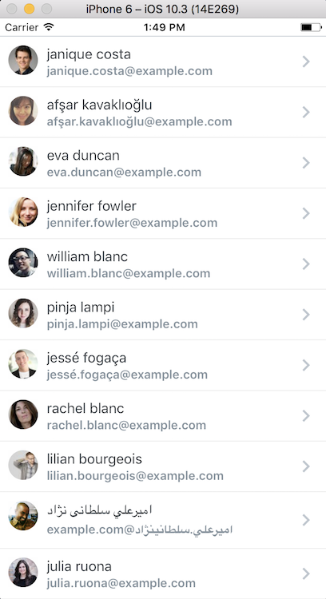
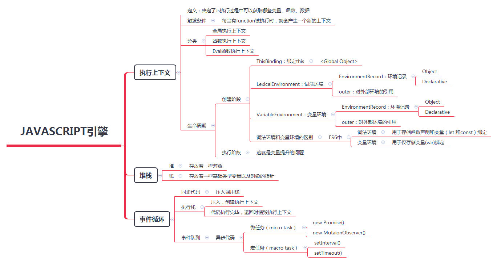

Javascript是单线程单一并发语言，这意味着它可以一次处理一个任务或一次处理一段代码。它有一个单独的调用堆栈，它与堆之类的其他部分一起构成了Javascript并发模型（在V8内部实现）。我们首先来看看这些术语：



下面是我总结的一张图片：



这里我展开讲，如果需要详细了解请参阅下面参考网址。

下面以一道面试题展开：

````
function Foo() {
    getName = function () { alert (1); };
    return this;
}
Foo.getName = function () { alert (2);};
Foo.prototype.getName = function () { alert (3);};
var getName = function () { alert (4);};
function getName() { alert (5);}

//请写出以下输出结果：
getName();
Foo().getName();
getName();
````

## 执行上下文

代码开始，引擎创建全局执行上下文：

1. 创建阶段
    
    - ThisBinding: 这边的`this`为window对象
    - 词法环境：
        - 环境记录：
            - Foo: <func>
            - getName: <func>
        - 外部环境引用：`null`
    - 变量环境：
        - 环境记录：
            - getName: undefined
        - 外部环境应用：<GlobalLexicalEnvironment>
        
    
正是由于javascript引擎会在执行上下文之前的创建阶段（即变量提升），所以代码实际上是变成如下：

````
function Foo() {
    getName = function () { alert (1); };
    return this;
}
var getName;//只提升变量声明
function getName() { alert (5);}//提升函数声明，覆盖var的声明
 
Foo.getName = function () { alert (2);};
Foo.prototype.getName = function () { alert (3);};
getName = function () { alert (4);};//最终的赋值再次覆盖function getName声明
````

所以第一问的答案输出为`4`。

2. 执行阶段

## 调用堆栈

假设当开始执行到`Foo().getName()`时，开始进入`Foo`函数，把`Foo`函数压入调用堆栈顶部。创建`Foo`局部执行上下文创建阶段：

- ThisBinding: 由于这边没有对象调用，故为this为`window`对象
- 词法环境：
    - 环境记录：
    - 外部环境引用：<GlobalLexicalEnvironment>
- 变量环境：
    - 环境记录：
        - getName: function(){ alert(4); }
    - 外部环境应用：<GlobalLexicalEnvironment>
    
`return this`返回时，`Foo`函数弹出栈顶，`Foo`局部执行上下文销毁。

故执行时第二问答案输出`1`；第三问因为`getName`已被第二问中修改，故输出`1`。

## 事件循环

事件循环是指主线程重复从消息队列中取消息、执行的过程。如果遇到同步函数，直接压入调用栈，如果异步代码，则委托给事件队列，然后继续运行代码，当异步处理返回时压入事件队列，主线程在执行完当前循环中的所有代码后，就会到消息队列取出这条消息，并执行它：


## 参考网址

- https://mp.weixin.qq.com/s/QljMmVPJ8k7eYB2ynV03LQ
- https://medium.com/@gaurav.pandvia/understanding-javascript-function-executions-tasks-event-loop-call-stack-more-part-1-5683dea1f5ec
- https://www.valentinog.com/blog/js-execution-context-call-stack/
- https://blog.bitsrc.io/understanding-execution-context-and-execution-stack-in-javascript-1c9ea8642dd0