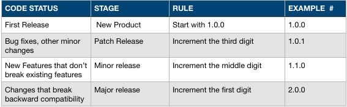

主要温习下npm知识，这篇不会很详细介绍npm的使用，而是记下认为有用的知识点。

<!-- more -->

## package.json

- name: 

    - 全部小写
    - 单个单词，不能有空格
    - 允许使用连字符和下划线
- bugs: issue地址

## 指定依赖类型

安装到生成依赖：

````
npm install <package_name> [--save-prod]
````

安装到开发依赖：

````
npm install <package_name> --save-dev
````

## 更新和检查更新

更新依赖：

````
npm update
````

检查过期包：

````
npm outdated
````

## 更新包版本

````
npm version <update_type>
````

update_type见下图。

## 语义化版本

当你的项目要分享给其他人时，你应该从`1.0.0`版本开始（尽管有些项目没有遵循这一点）。

### 针对开发者




- 初次发布：1.0.0
- 修复bug等其他修改：1.0.1
- 增加不影响旧版本使用的功能时：1.1.0
- 增加不向下兼容的功能时：2.0.0

> 当升级版本号，下级的版本号要置为0

### 针对使用者

- Patch releases: 1.0 or 1.0.x or ~1.0.4
- Minor releases: 1 or 1.x or ^1.0.4
- Major releases: * or x

> 比如我们项目依赖jquery版本`^1.0.4`，当我们`npm update`时，将会升级次要版本（Minor）到最新。

## 标签（dist-tag）

标签是对语义化版本的补充，使用它们来组织和标记不同版本的包。除了比semver编号更具人性可读性之外，标签还允许发布者更有效地分发他们的包。

### 打标签

````
npm dist-tag add <pkg>@<version> [<tag>]
````

### 发布标签

默认地，当我们运行`npm publish`时将会自动打上`latest`标签，如果你要发布其他名称的标签，比如：

````
npm publish --tag beta
````

### 安装标签

````
npm install somepkg@beta
````

> 因为dist-tag与semver共享相同的名称空间，所以请避免使用可能导致冲突的标记名称。最佳做法是避免使用以数字或字母“v”开头的标签。

## 理解包和模块之间的关系

Node.js和npm具有非常具体的包和模块定义，很容易混淆。我们将在这里讨论这些定义，使它们区别开来，并解释为什么某些默认文件以它们的方式命名。

### 概要

- 一个***包***是指被`package.json`描述的文件或目录。
- 一个***模块***是指可以被Node.js通过`require`加载的一些文件或目录。

### 什么是包

- a) 包含package.json文件描述的程序的文件夹。
- b) A gzipped tarball containing (a).
- c) A url that resolves to (b).
- d) A <name>@<version> that is published on the registry with (c).
- e) A <name>@<tag> that points to (d).
- f) A <name> that has a latest tag satisfying (e).
- g) A git url that, when cloned, results in (a).

### 什么是模块

- package.json包含main字段的文件的文件夹。
- 包含index.js文件的文件夹。
- 一个JavaScript文件。

### 大多数npm包都是模块

通常，加载Node.js程序中使用的npm包require，使它们成为模块。但是，并不要求npm包是一个模块！

某些包（例如cli包）仅包含可执行的命令行界面，并且不提供main在Node.js程序中使用的字段。这些包不是模块。

几乎所有的npm软件包都包含很多模块（因为它们加载的每个文件 require()都是一个模块）。

例如，如果您创建了一个文件，node_modules/foo.js然后有一个程序var f = require('foo.js')，它将加载该模块。但是，foo.js在这种情况下，它不是“包”，因为它没有package.json。

## npm audit 

npm audit 是 npm 6 新增的一个命令，可以允许开发人员分析复杂的代码并查明特定的漏洞。在刚刚发布的 npm 6.1.0 版本中，开发团队对该命令进行了完善。现在可使用 npm audit fix 子命令自动修复检测到的漏洞，而不必再自己进行跟踪和修复。

新版本针对 npm audit 还包括以下改进：

npm audit --json —— 新的子命令，用于以 JSON 格式打印报告

npm install 摘要输出中将包含审计软件包的数量

npm-audit-report@1.2.1 —— 对审计安装和输出格式进行了大幅调整，新格式更加紧凑，更符合 CLI 视觉风格，同时仍然提供所需的重要信息。

此外，npm 6.1.0 同样扩展了 npm init 命令的功能，新增对 git 包的支持，即 npm init <name>。

## 故障排除

- 更新node版本
- 更新npm版本
- 清除缓存：npm cache clean --force
- window上权限错误：`Error: ENOENT, stat 'C:\Users\<user>\AppData\Roaming\npm'`： 解决方法是确保C:\Users\<user>\AppData\Roaming\npm存在并且可以使用普通用户帐户写入。

> 参考网址：https://docs.npmjs.com/troubleshooting/common-errors

## npm配置

npm从以下来源获取配置，按优先级顺序：

### 命令行

`--foo bar`将会设置配置项foo值为bar，如果不传值，则设为true；`--flag1 --flag2 -- bar`中flag1和flag2将被设为true，bar将作为命令行参数。

### 环境变量

以`npm_config_/NPM_CONFIG_`开头的环境变量将会设置为配置项，如：`npm_config_foo=bar`，将设置配置项foo的值为bar，没有給值的将设为true。

### npmrc文件

这四个相关文件是：

- 当前项目下的配置文件（/path/to/my/project/.npmrc）
- 当前用户下的配置文件（默认是$HOME/.npmrc）
- 全局下的配置文件（默认是$PREFIX/etc/npmrc）
- npm的内置配置文件（/path/to/npm/npmrc）

### 查看npm当前配置

运行`npm config ls -l`以查看npm内部的一组配置参数，如果未指定其他任何配置参数，则为默认值：

````
; cli configs
long = true
metrics-registry = "http://192.168.0.62:7001/"
scope = ""
user-agent = "npm/5.5.1 node/v8.9.1 win32 x64"

; userconfig C:\Users\Administrator\.npmrc
//192.168.0.62:7001/:always-auth = false
//192.168.0.62:7001/:email = "liaoyf@sunsharing.com.cn"
//192.168.0.62:7001/:username = "liaoyf"
prefix = "D:\\nodejs"
registry = "http://192.168.0.62:7001/"
strict-ssl = false

; globalconfig D:\nodejs\etc\npmrc
msvs_version = "2015"
python = "C:\\Users\\Administrator\\.windows-build-tools\\python27\\python.exe"

; builtin config undefined
; prefix = "C:\\Users\\Administrator\\AppData\\Roaming\\npm" (overridden)

; default values
access = null
allow-same-version = false
also = null
always-auth = false
auth-type = "legacy"
bin-links = true
browser = null
ca = null
cache = "C:\\Users\\Administrator\\AppData\\Roaming\\npm-cache"
cache-lock-retries = 10
cache-lock-stale = 60000
cache-lock-wait = 10000
cache-max = null
cache-min = 10
cafile = undefined
cert = null
cidr = null
color = true
commit-hooks = true
depth = null
description = true
dev = false
dry-run = false
editor = "notepad.exe"
engine-strict = false
fetch-retries = 2
fetch-retry-factor = 10
fetch-retry-maxtimeout = 60000
fetch-retry-mintimeout = 10000
force = false
git = "git"
git-tag-version = true
global = false
global-style = false
globalconfig = "D:\\nodejs\\etc\\npmrc"
globalignorefile = "D:\\nodejs\\etc\\npmignore"
group = 0
ham-it-up = false
heading = "npm"
https-proxy = null
if-present = false
ignore-prepublish = false
ignore-scripts = false
init-author-email = ""
init-author-name = ""
init-author-url = ""
init-license = "ISC"
init-module = "C:\\Users\\Administrator\\.npm-init.js"
init-version = "1.0.0"
json = false
key = null
legacy-bundling = false
link = false
local-address = undefined
loglevel = "notice"
logs-max = 10
; long = false (overridden)
maxsockets = 50
message = "%s"
; metrics-registry = null (overridden)
node-version = "8.9.1"
offline = false
onload-script = null
only = null
optional = true
otp = 0
package-lock = true
parseable = false
prefer-offline = false
prefer-online = false
prefix = "D:\\nodejs"
production = false
progress = true
proxy = null
read-only = false
rebuild-bundle = true
; registry = "https://registry.npmjs.org/" (overridden)
rollback = true
save = true
save-bundle = false
save-dev = false
save-exact = false
save-optional = false
save-prefix = "^"
save-prod = false
scope = ""
script-shell = null
scripts-prepend-node-path = "warn-only"
searchexclude = null
searchlimit = 20
searchopts = ""
searchstaleness = 900
send-metrics = false
shell = "C:\\Windows\\system32\\cmd.exe"
shrinkwrap = true
sign-git-tag = false
sso-poll-frequency = 500
sso-type = "oauth"
; strict-ssl = true (overridden)
tag = "latest"
tag-version-prefix = "v"
timing = false
tmp = "C:\\Users\\ADMINI~1\\AppData\\Local\\Temp"
umask = 0
unicode = false
unsafe-perm = true
usage = false
user = 0
; user-agent = "npm/{npm-version} node/{node-version} {platform} {arch}" (overridden)
userconfig = "C:\\Users\\Administrator\\.npmrc"
version = false
versions = false
viewer = "browser"
````

### 查询简短语句

````
-v: --version
-h, -?, --help, -H: --usage
-s, --silent: --loglevel silent
-q, --quiet: --loglevel warn
-d: --loglevel info
-dd, --verbose: --loglevel verbose
-ddd: --loglevel silly
-g: --global
-C: --prefix
-l: --long
-m: --message
-p, --porcelain: --parseable
-reg: --registry
-f: --force
-desc: --description
-S: --save
-P: --save-prod
-D: --save-dev
-O: --save-optional
-B: --save-bundle
-E: --save-exact
-y: --yes
-n: --yes false
ll and la commands: ls --long
````

### 当前包的配置

````
// package.json
{ "name" : "foo"
, "config" : { "port" : "8080" }
, "scripts" : { "start" : "node server.js" } }

// server.js
http.createServer(...).listen(process.env.npm_package_config_port)

// cmd
npm config set foo:port 80
````

### 测试您的.npmignore或files配置是否有效

如果要在发布时仔细检查包中是否只包含您想要的文件，可以在npm pack本地运行命令，这将在工作目录中生成tarball，就像发布时一样。

### 链接包

npm link旨在安装开发包并实时查看更改，而无需继续重新安装。（当然，您需要重新链接或npm rebuild -g更新已编译的包。）

### 发布之前：确保您的包安装和工作

````
npm install . -g
````

那会告诉你它正在发挥作用。如果您只想创建指向工作目录的符号链接包，请执行以下操作：

````
npm link
````

要测试本地安装，请进入其他文件夹，然后执行以下操作：

````
cd ../some-other-folder
npm install ../my-package
````

将其本地安装到该位置的node_modules文件夹中。

### 创建用户帐户

````
npm adduser
````

然后根据提示进行。

## Semver语义化包的版本

安装：

````
npm install --save semver
````

示例：

````
const semver = require('semver')
 
semver.valid('1.2.3') // '1.2.3'
semver.valid('a.b.c') // null
semver.clean('  =v1.2.3   ') // '1.2.3'
semver.satisfies('1.2.3', '1.x || >=2.5.0 || 5.0.0 - 7.2.3') // true
semver.gt('1.2.3', '9.8.7') // false
semver.lt('1.2.3', '9.8.7') // true
semver.valid(semver.coerce('v2')) // '2.0.0'
semver.valid(semver.coerce('42.6.7.9.3-alpha')) // '42.6.7'
````

## package-lock.json

package-lock.json为npm修改node_modules树或的任何操作自动生成package.json。它描述了生成的确切树，以便后续安装能够生成相同的树，而不管中间依赖性更新。

