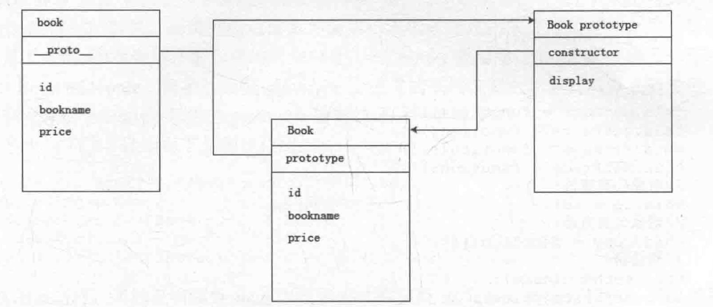

---
title: javascript设计模式-面向对象

date: 2018-04-06

tags:

    - javascript

    - 设计模式

----

## 灵活的javascript

假如有如下的校验表单方法：

```
function checkName(){

}

function checkEmail(){

}

function checkPassword(){

}
```

这样的声明可能会和别人写的冲突，我们可以把他们放在一个变量中，这样可以减少覆盖或者被覆盖的风险：

```
var CheckObject = {
    checkName: function(){...},
    checkEmail: function(){...},
    checkPassword: function(){...}
};
```

使用对象实现：

```
var CheckObject = function(){};
CheckObject.prototype.checkName = function(){};
CheckObject.prototype.checkEmail = function(){};
CheckObject.prototype.checkPassword = function(){};
```

这样别人就可以基于你的对象进行扩展。这样创建实例对象时，创建出来的对象所拥有的方法就只有一个。

```
var a = new CheckObject();
a.checkName();
a.checkEmail();
a.checkPassword();
```

这样有个问题，每次都要书写`a`对象，我们可以通过每个方法后面返回对象来支持链式调用：

```
var CheckObject = function(){};
CheckObject.prototype = {
    checkName: function(){
        ...
        return this;
    },
    ...
};
```

这样就可以通过`a.checkName().checkEmail().checkPassword()`来链式调用。

## 写的都是看到的

### 创建一个类

```
var Book = function(id, bookname, price){
    this.id = id;
    this.bookname = bookname;
    this.price = price;
};

Book.protype.display = function(){
};
```

使用类：

```
var book = new Book(10, 'javascript begin', 120);
book.display();
```

### constructor

constructor是一个属性，当创建一个函数或者对象时都会为其创建一个原型对象prototype，在prototype对象中又会创建一个constructor属性，那么constructor属性指向的就是拥有整个原型对象的函数或对象。



### 私有属性、私有方法、特权方法等

```
var Book = function(id, name, price){
    // 私有属性
    var num = 1;
    // 私有方法
    function checkId(){

    }
    // 特权方法
    this.getName = function(){};
    this.setName = function(){};
    // 对象公有属性
    this.id = id;
    this.name = name;
    this.price = price;
    // 对象公有方法
    this.copy = function(){};
    // 构造器
    this.sertName(name);
    this.setPrice(price);
};

// 静态公有属性
Book.isChinese = true;

Book.prototype = {
    // 公有属性
    isJSBook: true
};
```

有时候我们经常将类的静态变量通过闭包来实现：

```
var Book = (function(){
    var bookNum = 0;
    function checkBook(name){

    }

    return function(newId, newName, newPrice){
        var name, price;

        function checkID(id){}

        bookNum++;
        if(bookNum > 100){
            throw new Error('Error');
        }
    }
})();
```

闭包是有权访问另一个函数作用域中变量的函数，即在一个函数内部创建另一个函数。

## 继承

```
function SuperClass(){
    this.superValue = true;
}
SuperClass.prototype.getSuperValue = function(){
    return this.superValue;
};

function SubClass(){
    this.subValue = false;
}

// 继承父类
SubClass.prototype = new SuperClass();
SubClass.prototype.getSubValue = function(){
    return this.subValue;
};
```

另一种方式：

```
function SuperClass(){
    this.superValue = true;
}
SuperClass.prototype.getSuperValue = function(){
    return this.superValue;
};

function SubClass(){
    // 继承父类
    SuperClass.call(this);
    this.subValue = false;
}
```

组合继承:

```

function SuperClass(){
    this.superValue = true;
}
SuperClass.prototype.getSuperValue = function(){
    return this.superValue;
};

function SubClass(){
    // 继承父类
    SuperClass.call(this);
    this.subValue = false;
}

SubClass.prototype = new SuperClass();
```

洁净的继承者-原型式继承：

```
function inheritObject(o){
    function F(){}

    F.prototype = o;
    return new F();
}
```