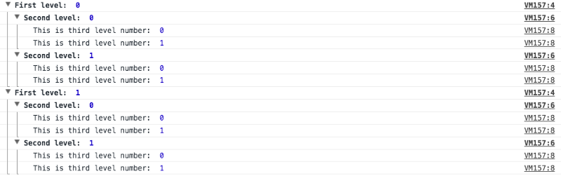
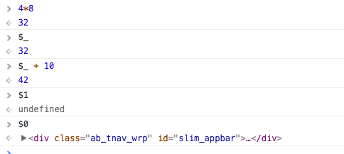
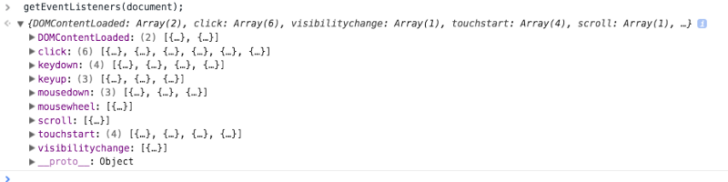
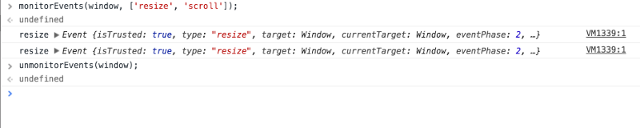
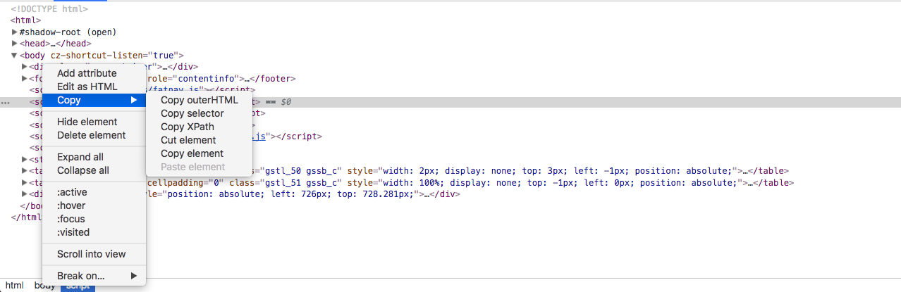

前端调试说简单也简单，说难也难，我们今天就以chrome浏览器为主，探究常用的调试技巧。

<!-- more -->
## 控制台

这里主要以控制台API为主：

### console.log —— 参考

考虑如下代码：

```
var fruits = [{one: 1}, {two: 2}, {three: 3}];
console.log('fruits before modification: ', fruits);
console.log('fruits before modification - stringed: ', JSON.stringify(fruits));
fruits.splice(1);
console.log('fruits after modification: ', fruits);
console.log('fruits after modification - stringed : ', JSON.stringify(fruits))
```


调试对象或数组时，需要小心。我们看到fruits 修改之前包含3个对象，但它们不再存在。要在此特定时刻查看结果，请使用JSON.stringify以保持信息可见。当然，对于较大的对象，这可能不方便。别担心; 稍后，我们会找到更好的解决方案。

### console.log —— 对象属性排序

javascript中的object类型是一个无序属性的集合，你无法确定你的对象属性是否有序，浏览器以各种方式实现，很高兴在chrome如下打印是按正常顺序排序的：

```
var letters = {
  z: 1,
  t: 2,
  k: 6
};
console.log('fruits', letters);
console.log('fruits - stringify', JSON.stringify(letters));
```

### console.assert(expression, message)

当表达式结果为`false`时会抛出错误信息`message`，但是assert不会中断代码的执行，它可能有助于调试冗长而棘手的代码，或者发现在多次迭代后显示自身的错误。

### console.count(label)

运行多少次：

```
for(var i =0; i <=3; i++){
	console.count(i + ' Can I go with you?');
	console.count('No, no this time');
}

// out
0 Can I go with you?: 1
No, no this time: 1
1 Can I go with you?: 1
No, no this time: 2
2 Can I go with you?: 1
No, no this time: 3
3 Can I go with you?: 1
No, no this time: 4
```

### console.table()

以表格形式展示对象或数组。虽然好看，但是懒得用......

### console.group() / console.groupEnd()

分组显示：

```
console.log('iteration');
for(var firstLevel = 0; firstLevel<2; firstLevel++){
  console.group('First level: ', firstLevel);
  for(var secondLevel = 0; secondLevel<2; secondLevel++){
	console.group('Second level: ', secondLevel);
	for(var thirdLevel = 0; thirdLevel<2; thirdLevel++){
  	console.log('This is third level number: ', thirdLevel);
	}
	console.groupEnd();
  }
  console.groupEnd();
}
```



### console.trace()

将堆栈跟踪打印到Console中：

```
function func1() {
  func2();
}
function func2() {
  func3();
}
function func3() {
  console.trace();
}
func1();
```


### $_, $0 - $4

`$_`返回最近的表达式的值。

`$0-$4`作为最近5个审查过的HTML元素的引用。



### getEventListeners(object)

返回在特定DOM元素上注册的事件侦听器。还有一种更方便的方法来设置侦听器，但我将在下一个教程中介绍它。



### monitorEvents(DOMElement, [events]) / unmonitorEvents(DOMElement)

如果触发了这些设置事件中的任何一个，我们将在控制台中获取信息。直到你取消监控事件。



### 复制数据

在对象上单击鼠标右键并按复制，或将其存储为全局元素。然后，您可以在控制台中操作存储的元素。

控制台中的任何内容也可以使用复制copy(‘object-name’)。

### 控制台样式化

```
console.log('%c Truly hackers code!', 'background: #222; color: #bada55');
```

- %d or %i — 整数
- %f — 浮点型
- %o — 可展开的DOM元素
- %O — 可展开的js对象
- %c — 样式化输出

## HTML/CSS

进入Elements选项卡的两种基本方法：

- 鼠标右键单击任意元素 > 审查元素

- 使用`ctrl + shift + i`打开DevTools并选择Elements选项卡

### 选项卡的左侧



首先，可以检查DOM树元素。要展开，请单击左侧的三角形。

通过单击鼠标右键，我们打开一些其他选项：

- `Add attribute` - 向所选元素添加新属性
- `Edit attribute` - 编辑属性，仅在单击属性时可用
- `Edit as HTML` - 通过选择此属性，您可以编辑整个元素; 也可用于复制要在其他地方使用的元素的一部分

复制：

- `Copy outerHTML` - 复制标记，包括标记本身和子元素
- `Copy selector` - CSS选择器的副本（div> span> #id）
- `Copy XPath` - XPath的副本// * [@ id =“answer11208745-20”] / div / div [3 ] /时间，更多进一步阅读
- `Cut element` - 剪切元素
- `Copy element` - 复制元素和子元素
- `Hide element` - 通过添加display：none;（cmd + H / ctrl + H）
- `Delete element` - 删除元素和子元素暂时隐藏元素，可以通过cmd + z反转
- `Expand all` - 展开所有节点
- `Collapse all` - 折叠所有节点
- `:active` - 将元素设置为活动状态* 
- `:hover` - 设置元素处于悬停状态* 
- `:focus` - 设置元素处于焦点状态* 
- `:visited` - 设置元素处于访问状态* 
- `Scroll into view` - 使您立即转到网页上的选定元素

断点：

- subtree modification - 在子树修改上设置断点** （这个在一些需要点击时间才能显示的情况下，如果：react-select的下拉框，是非常有用的）
- attribute modification - 在属性修改时设置断点** 
- node removal**

捕获节点截图：

在审查元素中，单击选中节点，按`ctrl + shift + p`打开命令菜单，输入`node screenshot`并选中`Captrue node screenshot`，即可对节点截图

## 参考网址

- https://blog.pragmatists.com/how-to-debug-front-end-elements-d97da4cbc3ea
- https://developers.google.com/web/tools/chrome-devtools/