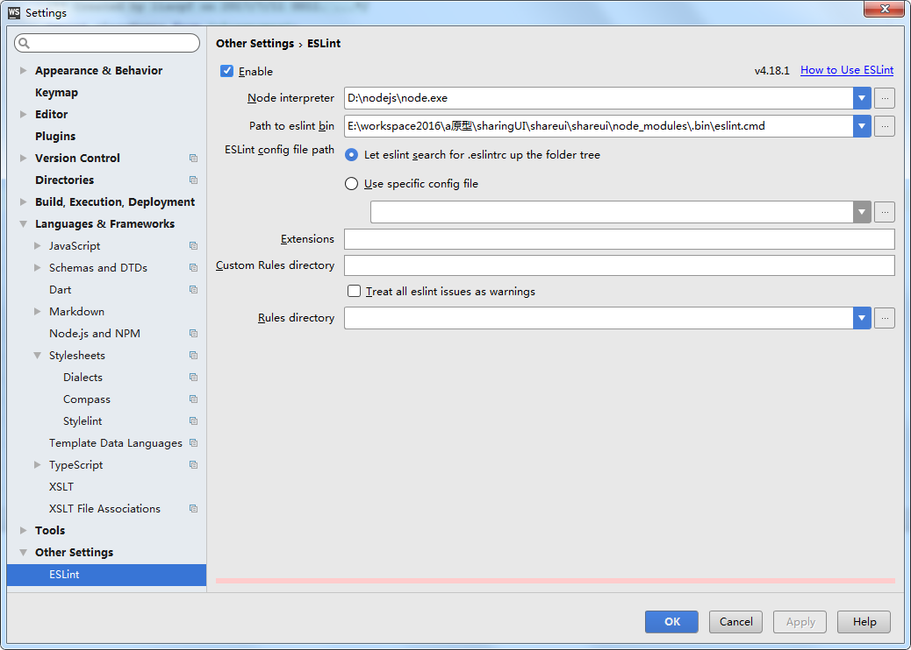

---

title: react-bootstrap读后感

date: 2018-2-2 10:13:42

tags: 

  - react

---

基于react-bootstrap的0.32.1版本。

## eslint

### extends

#### eslint-config-airbnb

使用了基于airbnb的js代码风格，详细了解：

- https://github.com/airbnb/javascript

- 中文版：https://github.com/yuche/javascript

<!-- more -->

#### prettier

格式化代码，使代码风格统一，详细了解：

- https://prettier.io/

## plugins

- [eslint-plugin-import](https://github.com/benmosher/eslint-plugin-import)：帮助校验是否正确导入模块

- [eslint-plugin-jsx-a11y](https://github.com/evcohen/eslint-plugin-jsx-a11y)：帮助校验React属性是否支持

- [eslint-plugin-prettier](https://github.com/prettier/eslint-plugin-prettier)：prettier的eslint插件

- [eslint-plugin-react](https://github.com/yannickcr/eslint-plugin-react)：React校验规则插件

## babel插件

- babel-plugin-transform-class-properties：转换class属性，如实例属性、类静态属性

- [babel-plugin-add-module-exports](https://github.com/59naga/babel-plugin-add-module-exports)：省去`require('module').default`中的`default`

- babel-plugin-transform-export-extensions：支持`export * as ns from 'mod'`和`export v from 'mod';`语法

- [babel-plugin-transform-object-rest-spread](https://babeljs.io/docs/plugins/transform-object-rest-spread/)：支持`...`运算符

- [babel-plugin-transform-runtime](https://babeljs.io/docs/plugins/transform-runtime/)：使用`babel-runtime`替换，免去引用`babel-polyfill`造成的全局变量污染

> 参考文章：
> - https://zhuanlan.zhihu.com/p/27777995
> - https://segmentfault.com/a/1190000009065987

## preset

- babel-preset-env

- [babel-preset-react](https://github.com/babel/babel/tree/master/packages/babel-preset-react)

## 感觉挺有用的第三方模块

- [chai](http://chaijs.com/)：Node.js的断言库

- [codecov](https://codecov.io/)：集成测试覆盖率工具

> 参考网址：
>  - https://www.jianshu.com/p/146c4769d4b1

- [colors](http://clrs.cc/)：很容易设置颜色

- [cross-env](https://github.com/kentcdodds/cross-env)：解决跨平台命令问题

- [enzyme](https://github.com/airbnb/enzyme)：测试React

- [fs-extra](https://www.npmjs.com/package/fs-extra)：为原生的`fs`模块添加`promise`支持

- [husky](https://github.com/typicode/husky)：Git hooks made easy

- [sinon](http://sinonjs.org/)：Standalone test spies, stubs and mocks for JavaScript. Works with any unit testing framework.

- [invariant](https://github.com/zertosh/invariant)：在开发环境下提示错误的快速写法

- [warning](https://github.com/BerkeleyTrue/warning)：facebook的warning，快速写警告

- [keycode](https://github.com/timoxley/keycode)：在键盘键码和键名之间进行转换，反之亦然

## 用到的测试框架

- [mocha](https://mochajs.org/)：Node.js的测试框架

- [karama](https://karma-runner.github.io/2.0/index.html)：JS测试框架

React好像推荐的是`Jest`框架，这个***有待了解***

## 编译提供的选择

- dist：使用`webpack`提供的`webpack`方法进行编译；

- lib：使用`babel`的`transform`方法编译；

- es：使用`babel`的`transform`方法编译，和`lib`方法不同的是少了一个`babel-plugin-add-module-exports`插件；（这个文件应该没什么用吧，现在浏览器支持率这么低）

- bower：复制`dist`文件夹

## 用到的一些JS语法

- 柯里化函数：

  - http://www.zhangxinxu.com/wordpress/2013/02/js-currying/

  - https://www.jianshu.com/p/f5033cec605e

- async/await：

  - http://es6.ruanyifeng.com/#docs/generator


- React获取子组件或父组件属性：

  - https://liaoyongfu.github.io/2017/08/02/react/react%E8%8E%B7%E5%8F%96%E7%88%B6%E7%BB%84%E4%BB%B6%E6%88%96%E5%AD%90%E7%BB%84%E4%BB%B6%E5%B1%9E%E6%80%A7/

## 使用yarn替换npm

运行`yarn`命令

## 忽略一些文件当别人安装时

通过制定`package.json`的`files`字段，或者也可以制定`.npmignore`。以下文件一定会包含：

- package.json

- README

- CHANGES / CHANGELOG / HISTORY

- LICENSE / LICENCE

- NOTICE

- `main`字段指定的文件

相反，以下文件总会被忽略：

- .git

- CVS

- .svn

- .hg

- .lock-wscript

- .wafpickle-N

- .*.swp

- .DS_Store

- ._*

- npm-debug.log

- .npmrc

- node_modules

- config.gypi

- *.orig

- package-lock.json (use shrinkwrap instead)

## 在webstrom中使用eslint校验

先安装eslint插件，配置`Eslint Plugin`：



然后打开`file/settings/Keymap`，搜索ESlint找到`Fix ESLint Problems`，右击选择`Add Keyboard Shortcut`， 键入`ctrl + e`（这里看个人习惯）

> 详细：https://github.com/idok/eslint-plugin

## gatsby

### 报错：`RootQueryType.allSitePage field type must be Output Type but got: SitePageConnection. `

运行`yarn list gatsby`发现会有多个依赖：

```
npm remove graphql
npm install gatsby
```

> 要统一一个版本的gatsby

### 报错`"jsonName" of undefined`

目录中不能包含中文目录

### Error: Schema must contain unique named types but contains multiple types named “JSON”

[暂时不知道为什么](https://stackoverflow.com/questions/48961250/error-schema-must-contain-unique-named-types-but-contains-multiple-types-named)

### 有时候要删除`.cache`文件并重启才能生效，不知道为什么？？？

### hexo d -g报错`[Windows] bash: /dev/tty: No such a device or address`

Try adding this into your git config
```
[credential]
    helper = wincred
```

or via console

```
git config --global credential.helper wincred
```

## shareui文档构建

首先在根目录下运行脚手架：

```
gatsby new doc 
cd doc
```

然后修改gatsby的配置：

```
const path = require("path");

module.exports = {
    siteMetadata: {
        title: "Shareui文档"
    },
    plugins: [
        "gatsby-plugin-react-helmet",
        {
            resolve: "gatsby-source-filesystem",
            options: {
                path: path.resolve(__dirname, "../src"),
                name: "source"
            }
        },
        "gatsby-transformer-react-docgen",
        {
            resolve: "gatsby-transformer-remark",
            options: {
                plugins: ["gatsby-remark-prismjs"]
            }
        },
        "gatsby-plugin-catch-links"
    ]
};
```

使用`gatsby-source-filesystem`可以方便查询本地文件的相关信息；使用`gatsby-transformer-react-docgen`方便查询组件信息。

在`src/pages`目录下新建`alert.js`（会自动生成alert页面）:

```
import React from "react";
import Link from "gatsby-link";
import PropTable from "../components/PropTable";

const Page = ({data}) => (
    <div>
        <h1>{data.componentMetadata && data.componentMetadata.description}</h1>
        <Link to="/">返回首页</Link>
        <PropTable metadata={data} />
    </div>
);

export const query = graphql`
    query AlertQuery {
        componentMetadata(displayName: {eq: "Alert"}) {
            ...PropTable_metadata
        }
    }
`;

export default Page;
```

其中的片段`PropTable_metadata`如下：

```
export const metadataFragment = graphql`
    fragment PropTable_metadata on ComponentMetadata {
        displayName
        description
        props {
            name
            type {
                name
                value
                raw
            }
            defaultValue {
                value
                computed
            }
            required
        }
    }
`;
```

为了列出所有的组件，我们使用`gatsby-source-filesystem`查询出在src目录下的所有组件，并添加到首页（`doc/src/index.js`）：

```
import React from "react";
import Link from "gatsby-link";

const IndexPage = ({data}) => (
    <div>
        <h3>基础组件</h3>
        <ol>
            {data.allFile.edges
                //先排序
                .sort((a, b) => {
                    if (a.node.name > b.node.name) {
                        return 1;
                    } else if (a.node.name < b.node.name) {
                        return -1;
                    }
                    return 0;
                })
                //排除index.js和utils下的文件
                .map(
                    (edge, index) =>
                        edge.node.relativeDirectory !== "utils" &&
                        edge.node.name !== "index" && (
                            <li key={index}>
                                <Link to={`/${edge.node.name}/`}>
                                    {edge.node.name}
                                </Link>
                            </li>
                        )
                )}
        </ol>
    </div>
);

export const query = graphql`
    query allComponent {
        allFile {
            edges {
                node {
                    name
                    relativeDirectory
                }
            }
        }
    }
`;

export default IndexPage;
```

读取组件的注释：

```
/**
 * 提示框（Alert）
 */
class Alert extends React.Component {
}
```

之后通过`data.componentMetadata.description`字段即可获取。

> 属性注释会报错`Error: Schema must contain unique named types but contains multiple types named “JSON”`，暂时不知道为什么